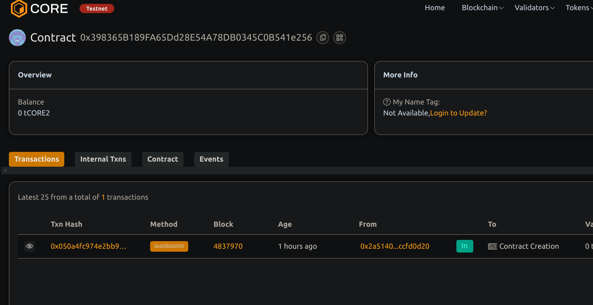

Proof of Attendance Protocol (POAP) for Events.

Project Title.
Proof of Attendance Protocol (POAP)

 Project  Description
This smart contract implements a simple Proof of Attendance Protocol (POAP) on the Ethereum blockchain. Attendees of events can claim unique NFTs as verifiable proof they participated. Each event is identified by an event ID, and attendees can only claim one POAP NFT per event.
A protocol that creats digital badges or collectibles theough the use of Blockchain technology.        Project Vision 
To provide an easy-to-use, trustless system for event   organizers and participants to record attendance transparently on-chain via non-fungible tokens (NFTs).
A block-chain based protocol desinged to provide proof of attendence or participation in events, activities, or experiences. 

Key Features

ERC721 NFT implementation for unique attendance tokens.
- Mapping to ensure one POAP NFT per event per attendee.
- Owner- controlled base URI for metadata.
- Emission of events on successful claims.
- Safe minting with unique token IDs.

Future Scope
 - Adding  event-specific metadata with richer details.
 - Integration with web frontends for easy claim interface.
 - Support for batch minting or airdrops by event organizers.
 - Advanced permissioning or   whitelisting of attendees.
- Interoperability with existing POAP platforms.

Contract details
0x398365B189FA65Dd28E54A78DB0345C0B541e256
 project created  Harshita Sen 
